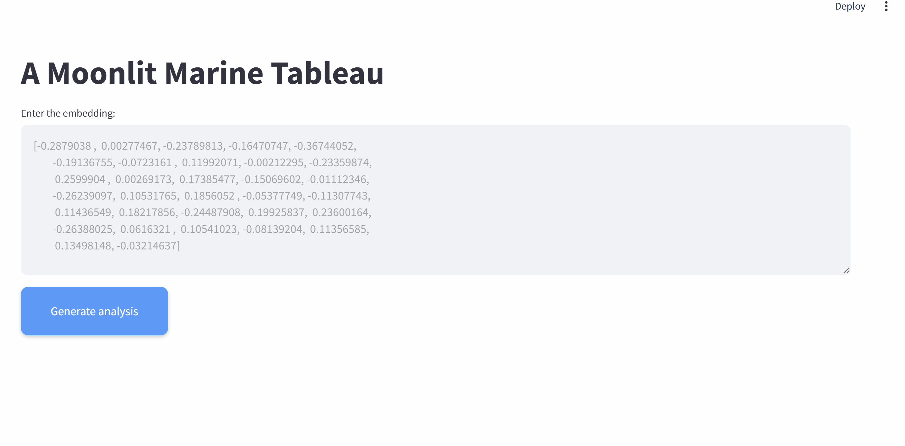

## Overview
This work takes embeddings (e.g., from one-shot models with Siamese networks) and generates descriptive captions.  Given an input image representing a patch of terrain (32x32), the model predicts the composition of the terrain, including percentages of different elements (e.g., "30% fucus and 70% asco") and the presence of nearby features (e.g., "with water nearby"). This uses results from my research work with one-shot models for multiband signals.

## Usage

Supply paths to FAISS index of embeddings and a CSV that maps embeddings to captions in config.toml. Naturally, if there are lots of embeddings, use Parquet instead.

```
cd src/main; streamlit run main.py
```


